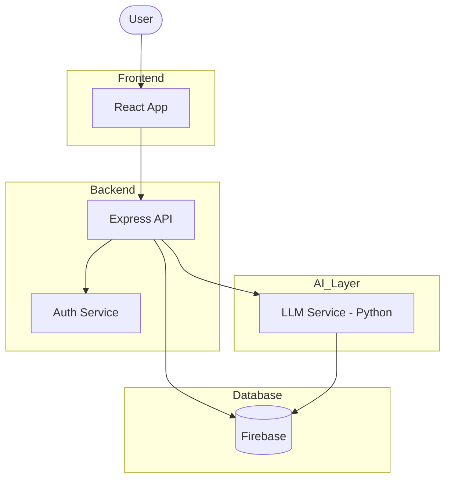

# 🚀 AlgoGuide — Personalized Interview Preparation Platform

AlgoGuide is an adaptive interview preparation platform designed to replace static problem lists with a personalized, data-driven learning experience. The system analyzes user performance, tracks topic proficiency, and recommends relevant problems and learning resources to accelerate preparation.

> [!IMPORTANT]
> **Backend Requirement**: This repository contains the **Frontend** code only. The full system architecture includes a Node.js/Express backend and a Python AI service. Ensure these services are running for full functionality.

---

## 📌 Motivation

Traditional interview preparation relies on fixed question sheets that do not adapt to individual strengths, weaknesses, or target roles. AlgoGuide creates a smarter workflow that evolves with the learner using performance analytics and AI-driven recommendations.

---

## 🏗️ System Architecture



---

## 🚀 Key Features

* 🧠 **Personalized Learning Paths** — Tailored based on user performance
* 📈 **Readiness & Progress Scoring** — Dynamic tracking of preparation
* 🎯 **Adaptive Problem Recommendations** — Smart next-question suggestions
* 🤖 **AI-Powered Assistance** — 24/7 doubt-solving mentor
* 🗣️ **Mock Interviews** — Real-time voice-based interviews
* 📊 **Analytics Dashboard** — Visual performance tracking
* 👨‍💻 **Code Editor** — Practice directly in browser

---

## 📊 How It Works

1. User defines preparation goals
2. Platform tracks topic-wise performance
3. Recommendation engine suggests next problems
4. AI assistant provides guidance
5. Readiness score updates dynamically

---

## 🔥 Core Concepts

* Adaptive Recommendation Systems
* Scalable Backend API Design
* Data-Driven Personalization
* AI-Assisted Workflows
* System Design Architecture

---

## ⚙️ Technology Stack

### Frontend

* React + Vite
* Tailwind CSS
* Clerk Authentication

### Backend

* Node.js
* Express.js
* Firebase (Firestore + Auth)

### AI & Analytics

* Python (LLM Integration)
* Voice AI: Vapi, Deepgram, ElevenLabs
* Performance Scoring Algorithms

### Tools

* Git
* VS Code
* Postman

---

## 🧩 Personal Contribution

* Designed full system architecture
* Built backend APIs (Node.js/Express)
* Integrated Firebase authentication and database
* Implemented AI-powered interview and recommendation system

---

## 🚧 Future Improvements

* Microservices architecture (Spring Boot)
* Advanced ML-based recommendation engine
* Enhanced analytics and insights

---

## 📋 Prerequisites

Make sure you have:

* Node.js (v18+)
* npm or yarn

---

## ⚙️ Installation

### 1. Clone Repository

```bash
git clone https://github.com/yourusername/AlgoGuide-Frontend.git
cd AlgoGuide-Frontend/AlgoGuide
```

### 2. Install Dependencies

```bash
npm install
```

### 3. Setup Environment Variables

Create a `.env` file:

```env
VITE_CLERK_PUBLISHABLE_KEY=your_clerk_key
VITE_FIREBASE_API_KEY=your_firebase_key
VITE_FIREBASE_AUTH_DOMAIN=your_project.firebaseapp.com
VITE_FIREBASE_PROJECT_ID=your_project_id
VITE_FIREBASE_STORAGE_BUCKET=your_project.appspot.com
VITE_FIREBASE_MESSAGING_SENDER_ID=your_sender_id
VITE_FIREBASE_APP_ID=your_app_id
VITE_FIREBASE_MEASUREMENT_ID=your_measurement_id
GEMINI_API_KEY=your_gemini_key
```

---

## 🏃‍♂️ Running the App

```bash
npm run dev
```

App runs at:

```
http://localhost:5173
```

---

## 📂 Project Structure

```
src/
├── components/
│   ├── roadmap/
│   ├── Hero.jsx
│   └── ...
├── pages/
│   ├── Dashboard.jsx
│   ├── Landing.jsx
│   ├── Onboarding.jsx
│   ├── SignIn.jsx
│   └── ...
├── SDEInterview.jsx
├── App.jsx
└── main.jsx
```

---

## 🤝 Contributing

1. Fork the repo
2. Create a branch

   ```bash
   git checkout -b feature/your-feature
   ```
3. Commit changes
4. Push to GitHub
5. Create Pull Request

---

## 📄 License

This project is licensed under the MIT License.

---

## ⭐ Final Note

AlgoGuide is not just a project — it's a **complete system design + AI application** showcasing:

* Full-stack engineering
* AI integration
* Scalable architecture

Perfect for **placements, internships, and portfolio** 🚀
